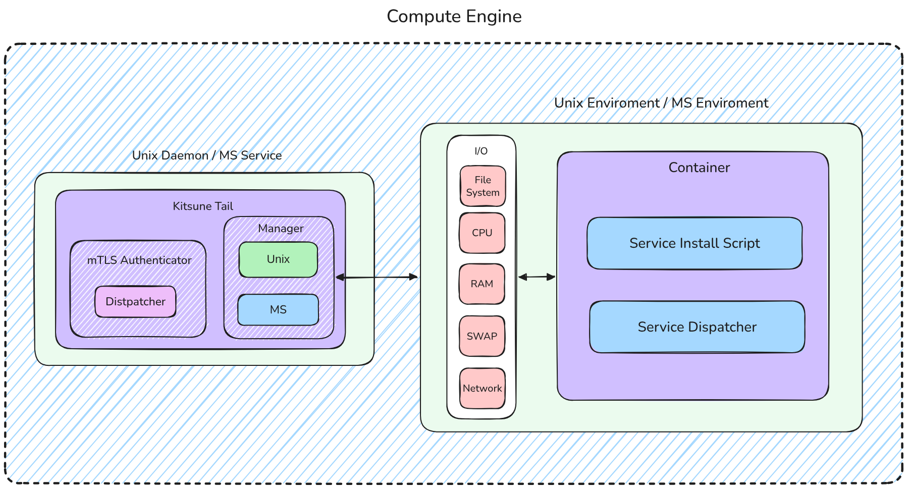

### Kitsune Tails (KTails) Architecture Summary
#### **Propósito y Alcance**
Kitsune Tails (**KTails**) actúa como el daemon o servicio central de orquestación encargado de gestionar todo el ciclo de vida de los contenedores de servicios (como servidores de juegos), desde su creación inicial hasta la abstracción y control del I/O del sistema.

**Seguridad y Autenticación mTLS:** La arquitectura implementa un mecanismo estricto de seguridad basado en certificados **mTLS**. Si los certificados no son validados correctamente, cualquier petición externa incluyendo la comunicación bidireccional entre el Panel central y KTails es rechazada de manera perimetral antes de procesar cualquier lógica.

--- 
### **Estructura Modular Interna**

- **mTLS Authenticator & Dispatcher:** El bloque frontal encargado de recibir las conexiones cifradas, verificar la identidad mediante criptografía y enrutar las órdenes validadas.
- **Managers (Unix / MS):** Una capa de abstracción polimórfica que separa la ejecución y el aislamiento según el sistema operativo anfitrión (manejando namespaces/cgroups en entornos Unix o _Process Isolation_ en Windows/MS).
- **I/O y Contenedor:** El subsistema que limita y monitorea los recursos físicos del host (File System, CPU, RAM, SWAP y Network) para alimentar tanto el script de instalación como el dispatcher interno del contenedor de forma aislada.

---
### High-Level Arquitecture Diagram
Abtraccion visual de la arquitectura de kitsune tails
